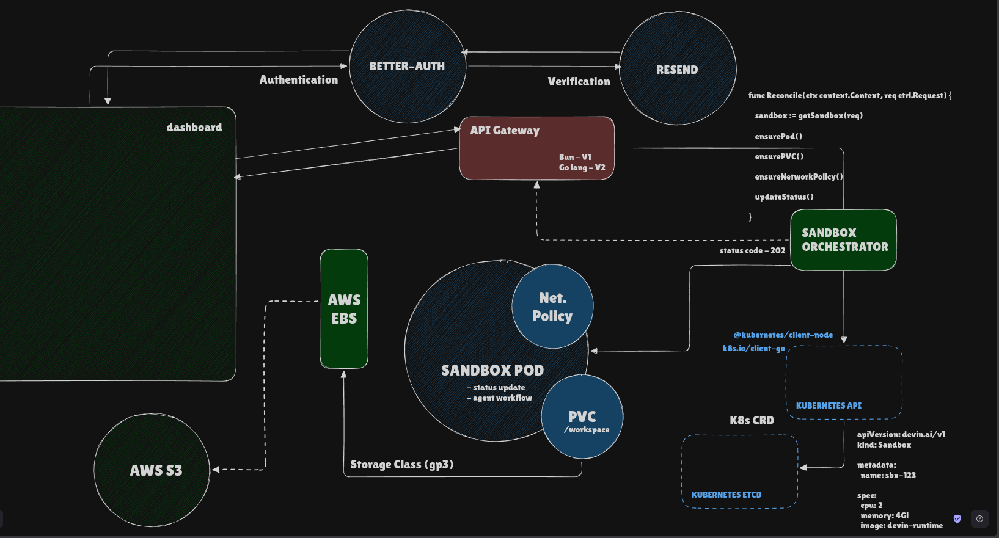

# Devin

Devin is an AI software engineer that helps teams plan, code, review, and ship faster. This repository contains the dashboard, API gateway, shared packages, and infrastructure definitions that power the platform.

## Architecture



Devin follows a cloud-native architecture. A Next.js dashboard talks to an API gateway, which delegates sandbox lifecycle management to a Kubernetes controller. Each sandbox runs as an isolated pod with persistent storage, network policies, and real-time status feedback.

### Components

#### Frontend & Authentication

| Component | Role | Implementation |
| --- | --- | --- |
| **Dashboard** | User-facing workspace for sessions, prompts, and agent activity | `apps/web` (Next.js) |
| **Better Auth** | Session management, magic links, and OAuth | `packages/api/v1` |
| **Resend** | Email delivery for verification and magic links | `packages/email` |

#### API Gateway

The API gateway is the central entry point between the dashboard and backend services.

| Version | Runtime | Location | Status |
| --- | --- | --- | --- |
| **V1** | Bun / Express | `apps/server`, `packages/api/v1` | Active |
| **V2** | Go | `packages/api/v2` | Planned |

The gateway receives task requests from the dashboard, forwards sandbox operations to the orchestrator, and relays asynchronous status updates from sandbox pods back to the client.

#### Sandbox Orchestrator

A Kubernetes controller that reconciles `Sandbox` custom resources into running infrastructure. For each sandbox it ensures:

- A **Pod** running the `devin-runtime` image
- A **PersistentVolumeClaim** mounted at `/workspace`
- A **NetworkPolicy** for pod isolation
- **Status updates** written back to the CRD

```go
func Reconcile(ctx context.Context, req ctrl.Request) {
  sandbox := getSandbox(req)
  ensurePod()
  ensurePVC()
  ensureNetworkPolicy()
  updateStatus()
}
```

The orchestrator uses `@kubernetes/client-node` (TypeScript) or `k8s.io/client-go` (Go) to interact with the Kubernetes API and returns `202 Accepted` while provisioning proceeds asynchronously.

#### Kubernetes Resources

Sandboxes are declared as a custom resource:

```yaml
apiVersion: devin.ai/v1
kind: Sandbox
metadata:
  name: sbx-123
spec:
  cpu: 2
  memory: 4Gi
  image: devin-runtime
```

The Kubernetes API persists CRD state in etcd. The controller watches for changes and drives the cluster toward the desired state.

#### Sandbox Runtime

Each sandbox pod is the isolated execution environment where the agent workflow runs:

- **Agent workflow** — code generation, testing, and task execution inside `/workspace`
- **Status updates** — streamed back to the API gateway for live dashboard feedback
- **Network policy** — restricts ingress and egress for security
- **PVC `/workspace`** — durable workspace storage backed by AWS EBS (`gp3` storage class)

Long-term artifacts such as snapshots and logs are archived to **AWS S3**.

### Request Flow

1. User authenticates via the dashboard through Better Auth (email verification via Resend).
2. Dashboard sends a task request to the API gateway.
3. Gateway forwards the request to the sandbox orchestrator.
4. Orchestrator creates or updates a `Sandbox` CRD in the Kubernetes API.
5. Controller reconciles the CRD — provisioning the pod, PVC, and network policy.
6. Agent runs inside the sandbox pod, persisting work to `/workspace`.
7. Pod sends status updates to the API gateway, which reflects them on the dashboard.

## Repository Structure

```
devin/
├── apps/
│   ├── web/              # Next.js dashboard
│   └── server/           # Bun API server (V1 gateway entrypoint)
├── packages/
│   ├── api/
│   │   ├── v1/           # Express + Better Auth routes (Bun)
│   │   └── v2/           # Go API gateway (planned)
│   ├── drizzle/          # PostgreSQL schema and migrations
│   ├── email/            # Resend email templates and client
│   ├── types/            # Shared TypeScript types
│   ├── validators/       # Shared validation schemas
│   ├── config/           # Shared configuration
│   └── ui/               # Shared React components
├── docker/               # Dockerfiles and Compose stacks
├── tests/
│   ├── e2e/              # End-to-end tests
│   └── integration/      # Integration tests
└── tooling/              # ESLint and TypeScript configs
```

## Getting Started

### Prerequisites

- [Bun](https://bun.sh) >= 1.2.3
- [Node.js](https://nodejs.org) >= 18
- Docker (for containerized development)

### Local Development

Install dependencies:

```sh
bun install
```

Run all apps with Turborepo:

```sh
bun run dev
```

Or run individual apps:

```sh
bun run dev --filter=@devin/web
bun run dev --filter=@devin/server
```

### Docker Compose

Start the full stack (PostgreSQL, API server, and web app):

```sh
docker compose -f docker/compose-dev.yaml up
```

| Service | URL |
| --- | --- |
| Dashboard | http://localhost:3000 |
| API server | http://localhost:8080 |
| PostgreSQL | localhost:5432 |

Copy environment files before running:

```sh
cp apps/server/.env.sample apps/server/.env
cp apps/web/.env.local.example apps/web/.env.local
```

### Database

```sh
bun run migrate    # Push schema to PostgreSQL
bun run studio     # Open Drizzle Studio
```

## Scripts

| Command | Description |
| --- | --- |
| `bun run dev` | Start all apps in development mode |
| `bun run build` | Build all apps and packages |
| `bun run lint` | Lint the monorepo |
| `bun run check-types` | Run TypeScript type checking |
| `bun run format` | Format code with Prettier |
