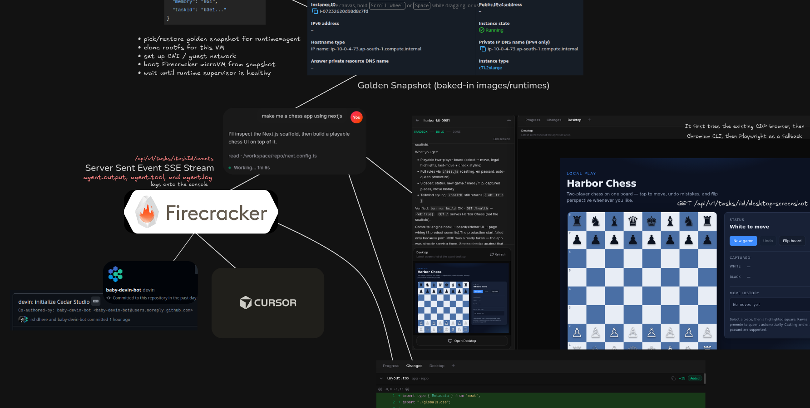

# Devin

**devin.baby** is a baby devin focused on the core software-engineering loop: submit work, get an isolated runtime, run the agent, stream progress, and persist results in `/workspace`.

## Approach

kubernetes is the **control plane**.

firecracker microVMs are the **execution plane**.

